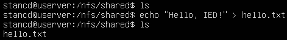

# Mounting an NFS share to IED

- [Mounting an NFS share to IED](#mounting-an-nfs-share-to-ied)
  - [Description](#description)
    - [Overview](#overview)
    - [General Task](#general-task)
  - [Requirements](#requirements)
    - [Used components](#used-components)
  - [Installation](#installation)
  - [Usage](#usage)
    - [Explanation](#explanation)
  - [Documentation](#documentation)
  - [Contribution](#contribution)
  - [Licence and Legal Information](#licence-and-legal-information)

## Description

### Overview

This is a tutorial on how to use a Network File System protocol (NFS for short) to connect a shared folder located on a server to a Industrial Edge Device and use it as a volume for Docker container.

Network File System is a file system protocol allowing a user on a client computer to access files over a network like a local storage.

This application example uses OpenSSH-server image made by LinuxServer.io. More info can be found at the following website: [OpenSSH-server website](https://hub.docker.com/r/linuxserver/openssh-server).

### General Task


The client is connected through SSH in Terminal to the OpenSSH-server container running on Industrial Edge Device. The server shares an NFS folder with Industrial Edge Device and the OpenSSH-server container uses this folder as a volume.

## Requirements

### Used components

- Docker Engine 18.09.6
- Docker-compose 1.25.0
- Ubuntu Server
  - nfs-kernel-server package

## Installation

A step by step installation guide can be found in the [docs](docs/installation.md)

If installed correctly, the *shared* folder at the server will be mounted to the *nfs* folder at the Industrial Edge Device.

## Usage

After installing the app to Industrial Edge Device, you should be able to SSH to the OpenSSH-server container to test that everything works correctly. Use the following credentials on your machine to connect to the Edge device to see how the NFS Docker volumes work. 

        ssh edge@192.168.178.20 -p 45555
        password: edge

### Explanation

1. This is the **server** side. As we can see, there is no file in *nfs/shared* folder. We create new file called *hello.txt* and write "Hello, IED!" into it.



*Note*: You may need to change folder permission to access the *nfs/shared* folder as the server user and to use the *echo* command to create and write to the *hello.txt* file. If that is the case, change the folder permission to be accessible to your user or use
```bash
  sudo chmod 777 -R nfs/
```
for testing purposes.

2. This is the **client** side. After changing directory to *nfs*, we can see that there is a file called *hello.txt* and it contains the message "Hello, IED!" written by the server. We then reply to this message with "Hello, Server!" and pass it to the *hello.txt* file.


3. When we take a look back at the server and read the file, we can see that the message successfully arrived and the *hello.txt* file now contains "Hello, Server!"


## Documentation

- You can find further documentation and help in the following links
  - [Industrial Edge Hub](https://iehub.eu1.edge.siemens.cloud/#/documentation)
  - [Industrial Edge Forum](https://www.siemens.com/industrial-edge-forum)
  - [Industrial Edge Landing page](http://siemens.com/industrial-edge)

## Contribution

Thank you for your interest in contributing. Anybody is free to report bugs, unclear documentation, and other problems regarding this repository in the Issues section. Everybody is free to propose any changes to this repository using Pull Requests.

## Licence and Legal Information

Please read the [Legal information](LICENSE.md).
