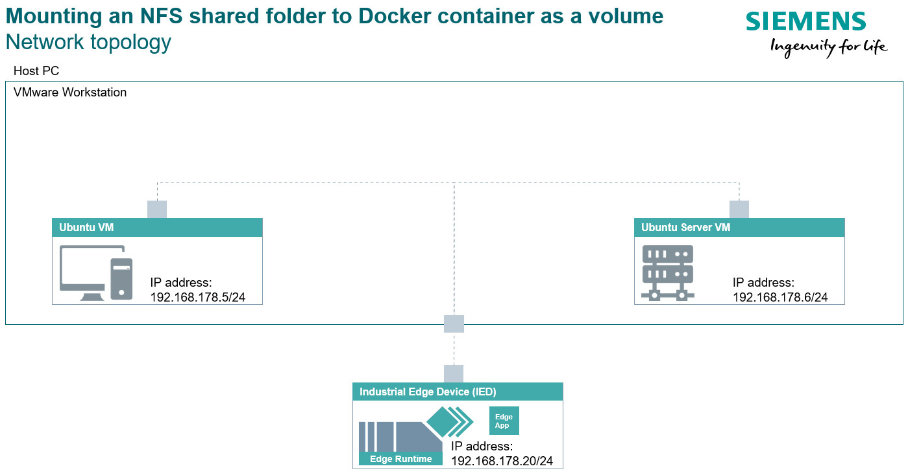

# Installation

## Network topology

## Server set-up

1. Install the nfs-kernel-server package on the server

        server$ sudo apt update
        server$ sudo apt install nfs-kernel-server

2. Create a directory on the server that will be shared with the client and change the ownership

        server$ sudo mkdir -p /nfs/shared
        server$ sudo chown nobody:nogroup /nfs/shared

3. Configure NFS *exports* file on the server

        server$ sudo vim /etc/exports
    The file has the following syntax

        directory_to_be_shared     share_to_who(option1,option2,...)
    So for our example, we will write

        /nfs/shared     192.168.178.20(rw,sync,no_subtree_check)

4. Restart the NFS server service

        server$ systemctl restart nfs-kernel-server

5. *Optional:* If you have firewall set up on the server, allow communication for the client

        server$ sudo ufw allow from 192.168.178.20 to any port nfs

## Industrial Edge Device set-up

After setting up the server, install the app to the Industrial Edge Device.

For more information on how to install an app to the Industrial Edge Device, you can follow this link: [Installing applications to Industrial Edge Device](https://github.com/industrial-edge/pingpong-python/blob/main/docs/Installation.md#installing-the-application-to-a-industrial-edge-device)
